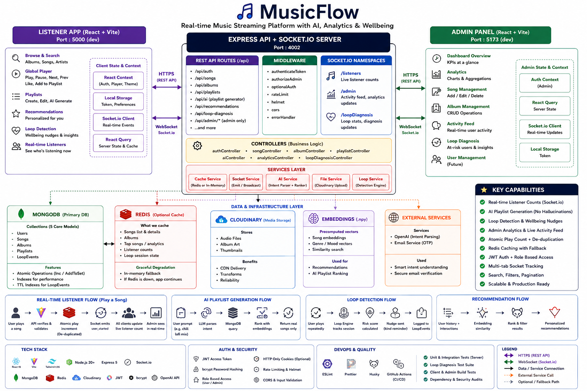
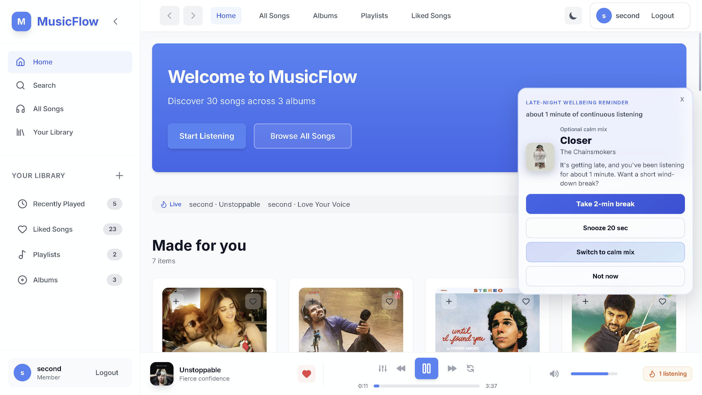
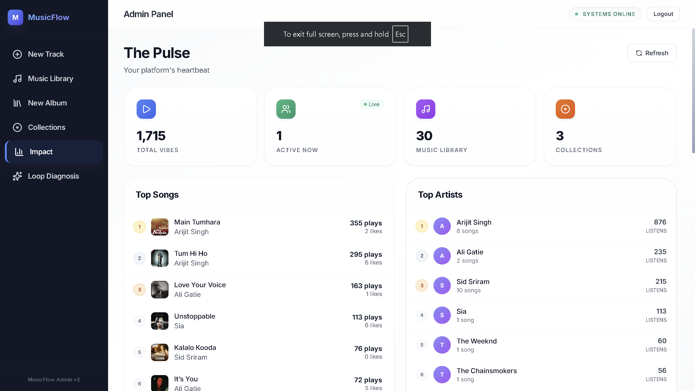
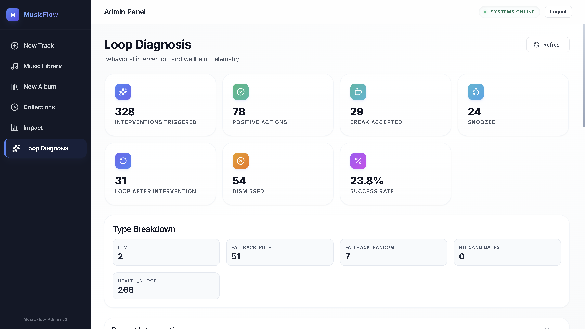

# MusicFlow

[](LICENSE)
[](https://nodejs.org/)
[](https://expressjs.com/)
[](https://www.mongodb.com/)

Full-stack music web app: React listener client, separate React admin panel, and an Express API with Socket.io, optional Redis, and MongoDB. A production-style music streaming app built from scratch — real-time listener counts via Socket.io, AI playlist generation, a loop-detection wellbeing system, and a full admin panel with live analytics. Built to understand how streaming products actually work under the hood.

---

## The problem I cared about

Playlist apps are easy to mock in a UI. They are harder to get right when play counts matter, many tabs are open, admins need honest analytics, and you still want recommendations that do not hallucinate tracks that do not exist in your database. This repo is my answer: one API that serves two frontends, keeps counts consistent, and separates “LLM help” from “data the app actually owns.”

---

## What it does (for real)

**Listener (`client/`)**  
Sign up, log in, browse albums, play audio with a global player, like songs, build playlists, run an AI playlist generator (prompt in → query and rank from Mongo only), see recommendations, search the library, and—if enabled—get loop-detection nudges when the same song repeats a lot.

**Admin (`admin/`)**  
JWT-protected dashboard: add/delete songs and albums (Cloudinary uploads), charts (aggregations), live-ish activity feed, loop-diagnosis stats.

**API (`server/`)**  
REST under `/api/*`, Socket.io for listener counts and realtime fan-out, optional Redis for caching and loop-session state with in-memory fallback, Cloudinary for media, bcrypt + JWT for users and admin role checks.

---

## Tech stack

| Area | Choice | Why it is there |
|------|--------|-----------------|
| Listener UI | React 19, Vite, Tailwind | Fast dev, small bundle story with manual chunks in Vite |
| Admin UI | React 19, Vite, Tailwind | Same toolchain, isolated bundle and auth context |
| API | Node 20+, Express 5, ESM | One process for HTTP + Socket.io |
| Data | MongoDB + Mongoose | Flexible documents for songs, users, playlists, loop events |
| Cache | Redis (optional) | Song/listener caching; code paths tolerate Redis being off |
| Realtime | Socket.io | Listener counts + admin events on default namespace; /loopDiagnosis for interventions |
| Media | Cloudinary | Hosted audio + art |
| Auth | JWT + bcrypt | Stateless API auth; admin routes gated by role |
| Ranking / AI | Embeddings `.npy`, heuristics, LLM intent parsing | Recommendations + playlist intent without inventing songs |

---

## What I Built — By The Numbers

| Metric | Detail |
|--------|--------|
| Frontends | 2 separate React apps (listener + admin) |
| API endpoints | 30+ REST routes across auth, songs, albums, playlists, AI, loop-diagnosis |
| Real-time | Socket.io default namespace + /loopDiagnosis; admin updates via rooms |
| Auth system | JWT + bcrypt, role-based (user vs admin), multi-tab sync |
| AI feature | LLM intent parser → MongoDB query → ranked results (no hallucinated songs) |
| Wellbeing system | Loop-detection that nudges users when same song repeats excessively |
| Test coverage | Server unit tests + loop-diagnosis suite + client/admin CI builds |

---

## Repository layout

```text
MusicFlow/
├── client/                 # Listener React app (Vite dev server, default port 5000)
├── server/                 # Express + Socket.io (`server.js`, `src/`, `tests/`)
├── admin/                  # Admin React app (Vite, default port 5173)
├── docs/                   # Long-form technical write-up
│   └── FINAL_PROJECT_GUIDE.md
├── data/                   # Optional interaction export for embedding pipeline (`data/data.json`)
├── tests/                  # Placeholder for future cross-package tests (API tests live in `server/tests/`)
├── screenshots/            # Drop UI captures here for your portfolio README previews
├── scripts/                # Repo-level helpers (loop sim, hooks, etc.)
├── .github/workflows/      # CI: tests + lint + build + audits
├── .env.example            # Copy to repo root `.env` for local API
└── README.md               # You are here
```

---

## Architecture (short)

```text
   ┌─────────────┐     ┌─────────────┐
   │   client    │     │    admin    │
   │ (Vite :5000)│     │ (Vite :5173)│
   └──────┬──────┘     └──────┬──────┘
          │  proxy /api       │  proxy /api
          └─────────┬─────────┘
                    ▼
            ┌───────────────┐
            │    server     │  HTTP + Socket.io (:4002)
            └───────┬───────┘
                    │
        ┌───────────┼───────────┐
        ▼           ▼           ▼
    MongoDB      Redis      Cloudinary
   (required)   (optional)   (media CDN)
```

- **Vite** in both frontends proxies `/api` and `/socket.io` to the API in development so you rarely need CORS gymnastics locally.
- **Production** can serve the built listener SPA from `server/client-dist/` after `npm run build:client`, or set `FRONTEND_DIST` to any folder that contains `index.html`.

### Full System Architecture



Deep dive (routes, models, edge cases, interview notes): [docs/FINAL_PROJECT_GUIDE.md](docs/FINAL_PROJECT_GUIDE.md).

---

## Screenshots

### Client

**Home screen**



**AI playlist generation (GIF)**


### Admin

**Overview (GIF)**


**Analytics dashboard**



**Loop diagnosis panel**



---

## Setup

**Prerequisites:** Node.js 20+, MongoDB URI, Cloudinary account, optional Redis.

1. **Environment**

   ```bash
   cp .env.example .env
   ```

   Fill at least `MONGODB_URI`, `JWT_SECRET`, and the `CLOUDINARY_*` fields. Redis is optional; set `REDIS_ENABLED=false` if you skip it.

2. **Client env (optional)**

   ```bash
   cp client/.env.example client/.env
   ```

   Leave `VITE_API_URL` empty when using the Vite proxy.

3. **Install and run (three terminals)**

   ```bash
   cd server && npm install && npm run server
   ```

   ```bash
   cd client && npm install && npm run dev
   ```

   ```bash
   cd admin && npm install && npm run dev
   ```

   API default: `http://localhost:4002`. Client dev: `http://localhost:5000`. Admin dev: `http://localhost:5173`.

---

## How pieces talk

### HTTP API

JSON REST under `/api/auth`, `/api/song`, `/api/album`, `/api/playlist`, `/api/admin`, `/api/ai`, `/api/loop-diagnosis`, etc. Controllers own validation and side effects (play dedupe, like counters, playlist CRUD).

### Authentication

- Register/login return a JWT. The **client** stores it in `localStorage`, sets `Authorization` on axios, and listens for `storage` events so multiple tabs stay in sync.
- **Admin** uses the same token shape but separate layout and route guards; `role: admin` is required for destructive catalog routes.
- **Socket.io** reads the token from `handshake.auth`, query, or `Authorization` header, verifies it with `JWT_SECRET`, and joins per-user or `admin` rooms for targeted emits.

### Redis

When enabled, Redis backs cache helpers and loop-diagnosis counters/session keys. If Redis is down, the code falls back to in-memory structures where it can so local development still works.

### Socket.io

Used for live listener counts, pushing recent listening events, admin activity, and the `/loopDiagnosis` namespace for wellbeing-style interventions. The server deduplicates socket ↔ user mappings and can mirror “who is listening” in Redis when available.

**LLM usage (playlists)** — `POST /api/playlist/generate` uses OpenRouter to interpret prompt intent and always pulls song IDs from MongoDB (never LLM output).

When `LLM_PROVIDER=openrouter`, the backend hits the OpenRouter Chat Completions API at `https://openrouter.ai/api/v1`.

### Recommendations

Hybrid scoring: embedding similarity plus recent feedback signals (`play`, `like`, `skip`, …). Cold users get heuristic mixes until there is enough signal. Optional `data/data.json` export feeds mapping logic when you run the embedding pipeline scripts.

---

## Tests and CI

```bash
cd server && npm test
cd server && npm run test:ld
cd client && npm run ci
cd admin && npm run ci
```

GitHub Actions (`.github/workflows/quality-gates.yml`): server tests + high-severity audit, client and admin lint/build/audit, then `npm run build:client` to prove the SPA copy step works.

---

## Challenges (honest)

- **Play count spam:** solved with a short server-side dedupe window and guarding concurrent play handlers so double-clicks do not inflate counts.
- **Context re-renders in the player:** keeping heavy playback state out of React context fields that change every frame took a few iterations; the write-up in `docs/FINAL_PROJECT_GUIDE.md` calls out the approach.
- **Redis present but not guaranteed:** every feature that likes Redis has a boring fallback so `npm run server` still works on a laptop without Docker.
- **Windows + Node’s test runner:** passing a directory to `node --test` was flaky here, so the server uses `scripts/run-node-tests.mjs` to expand test files explicitly—same behavior on Linux CI.

---

## What I learned

- Treat LLMs as **planners**, not databases: keep retrieval in code you control.
- Socket auth deserves the same seriousness as REST auth if you emit user-specific data.
- **Monorepo-ish** layout pays off when one `build:client` step has to land static files beside the API for a single deploy target.

---

## Future work

- Proper E2E (Playwright) for auth + play + admin upload.
- Stricter httpOnly cookie session option instead of `localStorage` tokens.
- Typed OpenAPI spec generated from routes for frontend clients.

---

## Author

Maintained by **MOHD IBADULLAH** · [GitHub Profile](https://github.com/mohd-ibadullah) · [LinkedIn](https://www.linkedin.com/in/mohd-ibadullah-12a046280)

---

## License

ISC
